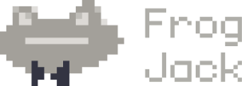

<br />
<div align="center">
  <a href="#">
    
  </a>

  <p align="center">
    Made using ReactJS and Tailwind!
    <br />
    <br />
    <a href="https://frogjack.netlify.app/">View Demo</a>
    ·
    <a href="https://github.com/erickctra/frog-jack/issues">Report Bug</a>
    ·
    <a href="https://github.com/erickctra/frog-jack/issues">Request Feature</a>
  </p>
</div>

## About The Project


### Built With

Here are the libraries that I used in this project

- [React.js](https://reactjs.org/)
- [TailwindCss](https://tailwindcss.com/)

<!-- GETTING STARTED -->

## Getting Started

This is an example of how you may give instructions on setting up your project locally.
To get a local copy up and running follow these simple example steps.

### Prerequisites

To run this project you will need to have Node.js installed

- [Node](https://nodejs.org/en/)

### Installation

Follow the instructions to clone this project

2. Clone the repo
   ```sh
   git clone https://github.com/erickctra/frog-jack.git
   ```
3. Install NPM packages
   ```sh
   npm install
   ```
4. Run
   ```js
   npm run dev
   ```

<p align="right">(<a href="#top">back to top</a>)</p>
