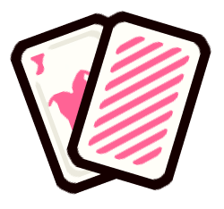

 

  

  <h3 align="center">BlackJack</h3>

  

    Made using ReactJS and Stitches!
     
     
    <a href="https://github.com/othneildrew/Best-README-Template">View Demo</a>
    ·
    <a href="https://github.com/erickctra/blackjack/issues">Report Bug</a>
    ·
    <a href="https://github.com/erickctra/blackjack/issues">Request Feature</a>
  

## About The Project

[![Product Name Screen Shot][product-screenshot]](https://github.com/erickctra/blackjack/public/assets/screenshot.png 'Screenshot')

### Built With

Here are the libraries that I used in this project

- [React.js](https://reactjs.org/)
- [Stitches](https://stitches.dev/)
- [CuteCard assets](https://dani-maccari.itch.io/cute-cards-deck)
